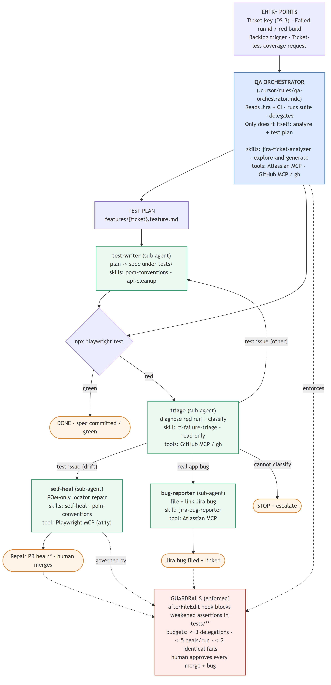
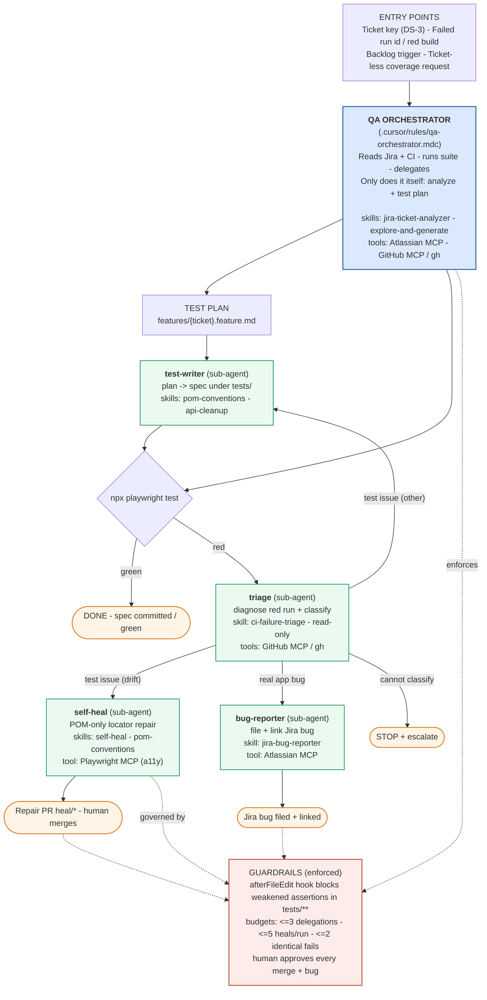

# QA Harness Architecture

How the QA orchestrator drives a task to done by delegating to specialist sub-agents,
including the skills, tools, and guardrails wired around each.

## How it reads

- **Orchestrator** is the only coordinator — it reads the ticket/CI, produces the plan,
  runs the suite, and **delegates everything else**. It writes no test code and files no
  bugs itself.
- **Four sub-agents**, each single-purpose:
  - `test-writer` — plan → spec (POM + cleanup skills, `tests/` only)
  - `triage` — read-only diagnosis + classification of red runs
  - `self-heal` — POM-only locator repair after a **drift** classification → repair PR
  - `bug-reporter` — files a Jira bug only on a confirmed **real app bug**
- **Routing on red** is triage-first, then branch by classification (drift → self-heal,
  real bug → bug-reporter, other → test-writer).
- **Guardrails** wrap the loop: the `afterFileEdit` hook hard-blocks weakened assertions,
  budgets cap delegations/heals, and humans gate every merge and bug.
